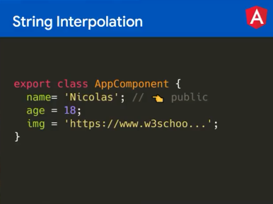
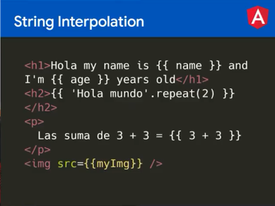

#### Impartido por: Nicolas Molina
#### Plataforma: Platzi
#### Link del curso: [FrontEnd Developer](https://platzi.com/cursos/angular/)
#### Fecha: 17-09-2022
# XXX - Curso de Fundamentos de Angular

## Introducción
Angular es un framework de JavaScript que posee todo un ecosistema de tecnologías con módulos y paquetes listos para utilizar para el desarrollo web del lado del cliente.

Angular por defecto no posee estilos, pero se pueden agregar de forma muy sencilla. La parte visual de la aplicación es muy importante porque es lo que más le interesa al usuario final. En ese sentido, Angular Material es un framework de estilos para tus aplicaciones.

Desarrollado por Google, Angular es más que un framework, es una plataforma que nos da la posibilidad de desarrollar aplicaciones web como aplicaciones mobile. Además, es un framework de estructura que nos va a brindar funcionalidades para extender el template de nuestra aplicación.

## Principales Caracteristicas
* Está respaldado y desarrollado por Google.
* Es multi-plataforma para desarrollo de aplicaciones web, móviles o de escritorio.
* Tiene excelente experiencia de desarrollo gracias a TypeScript y a herramientas de detección de errores y autocompletado de código propias de Angular.
* Posee una gran comunidad mundial donde sea que te encuentre en todo el mundo

## Instalación 
1. Instalar node
2. Instalar npm
3. Instalar angular
4. Ver versión 

## Comandos
| Comando | Descripción |
| ------- | ----------- |
| npm -v  | Ver versión de npm |
| node -v | ver versión de node |
| npmi -g @angular/cli | instalar angular |
| ng --version | ver versión de angular|
| ng new nombre | crear un nuevo proyecto de angular |
| ng serve | levantar servidor para la página de angular |
| ng serve -o | levantar servidor para la página de angular y abrirlo solo |
| ng serve --port=x| levantar servidor para la página de angular y asignarle un puerto especificio |

## Configuraciones
* .nvmrc en ese archivo se indica cual es la versión correcta de node para correr ese proyecto.

## String Interpolation
Se hace para mostrar valores de string en el archivos .ts de un componente, en la parte visual del HTML solo se necesita poner {{}}, y tambien se puede asigar el valor de una variable a la ruta del src de una imagen
### Ejemplos

